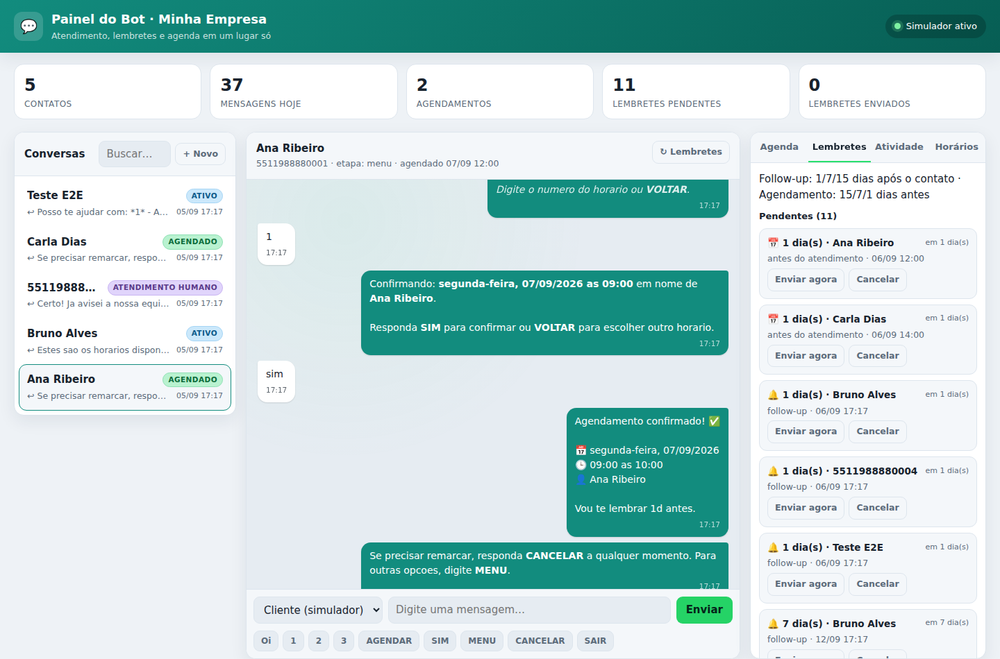
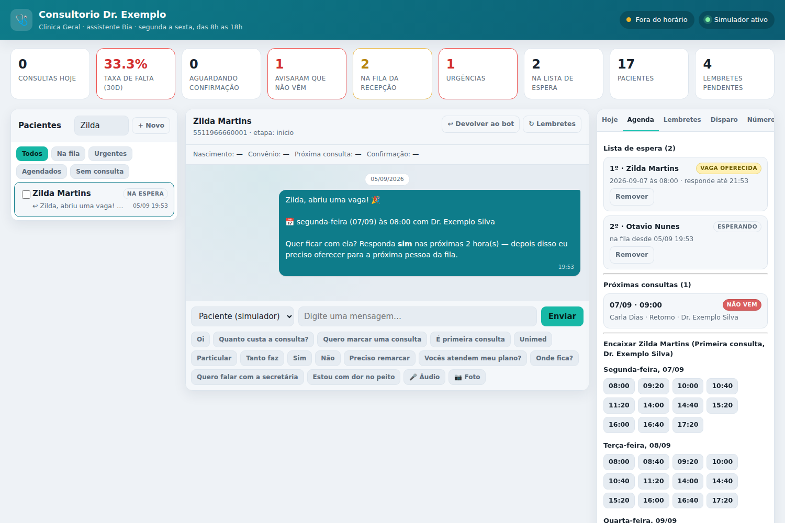
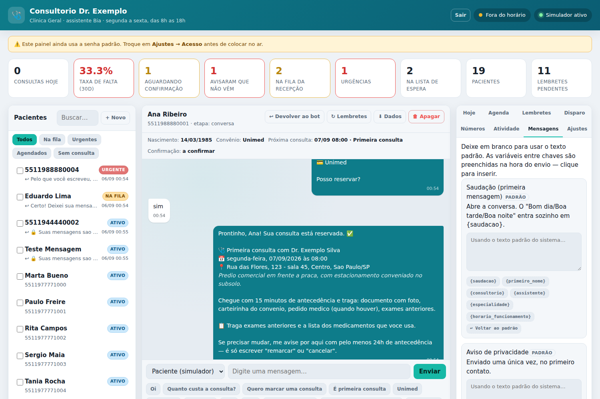
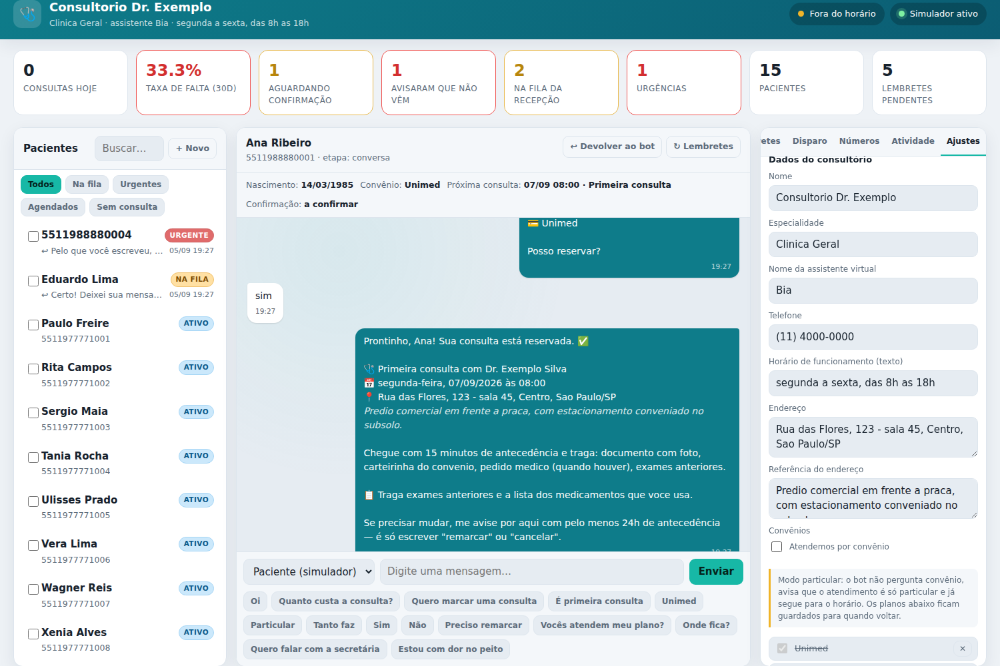
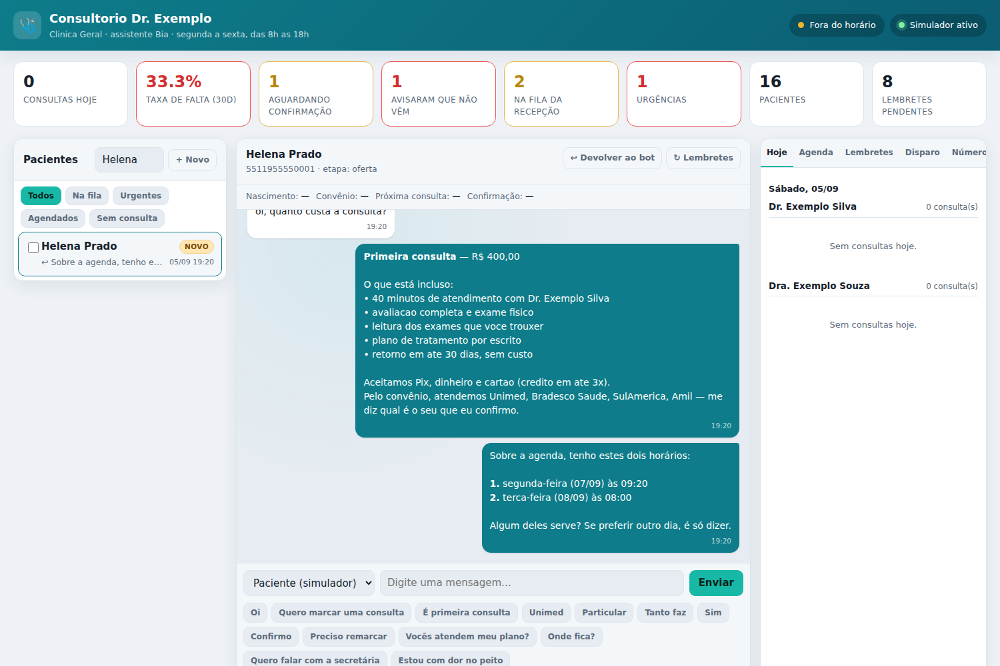
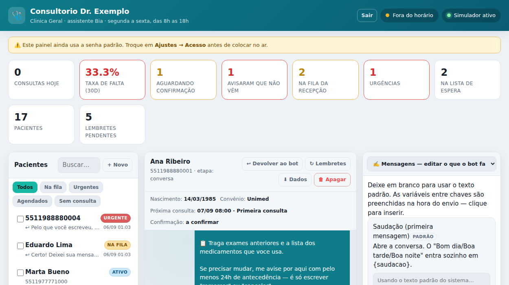
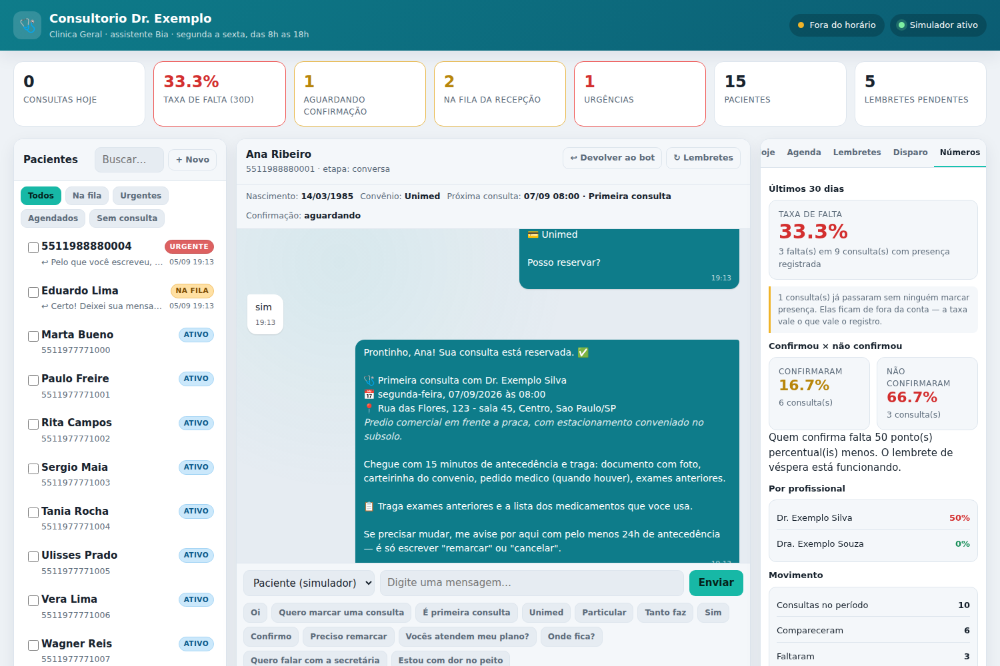
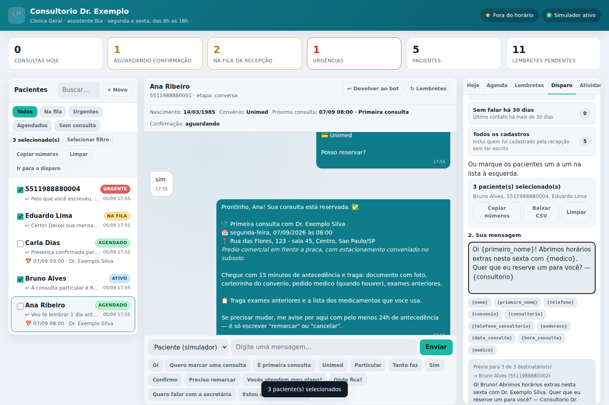
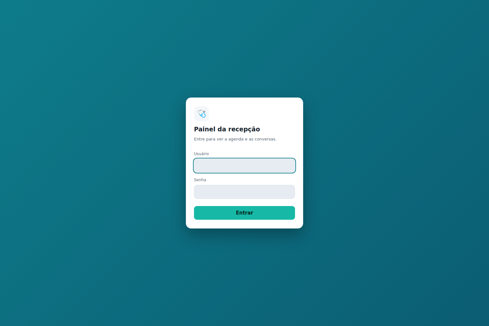
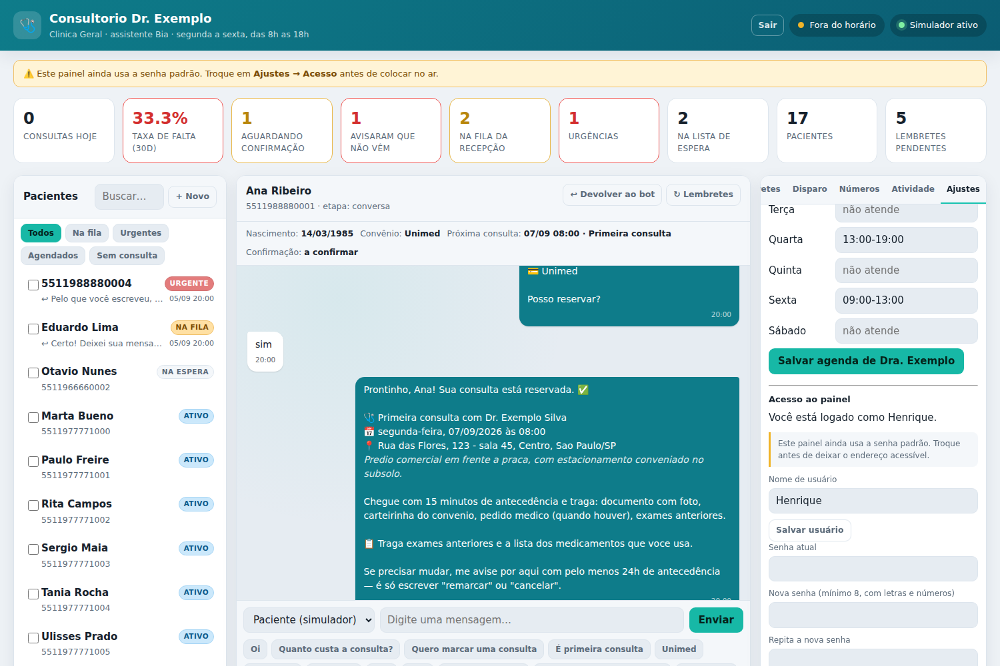

# Botwhats — autoatendimento humanizado de consultório no WhatsApp

Assistente de WhatsApp para consultório médico: recebe o paciente com uma **saudação natural**,
**agenda consultas** na agenda dos profissionais, envia **lembretes de 1, 7 e 15 dias**, pede
**confirmação de presença** e mantém um **painel para a recepção** acompanhar tudo em tempo real.



## Por que "humanizado"

O bot conversa como a recepção conversaria — não como uma URA.

| Em vez de | O bot faz |
| --- | --- |
| "DIGITE 1 PARA AGENDAR" | Entende *"queria marcar uma consulta"*, *"preciso de um retorno"*, *"tanto faz"*, *"às 10h"*. Os números são atalho da lista, não obrigação |
| Repetir a mesma frase | Alterna variações de saudação e de resposta, e chama o paciente pelo primeiro nome |
| Ignorar o contexto | Se perguntam o endereço no meio do agendamento, ele responde **e retoma de onde parou** |
| Insistir quando não entende | Depois de três tentativas, passa para a secretária em vez de repetir o menu |
| Mandar tudo de uma vez | Pausa entre mensagens proporcional ao tamanho do texto, como alguém digitando |
| Chutar | *"8h"* com 08:00 e 08:20 livres vira *"tenho 08:00 e 08:20, qual delas?"* |

## Lista de espera e encaixe

Quando não há horário livre, o bot não encerra a conversa: oferece a fila. E quando um horário
volta para a agenda — cancelamento pelo paciente ou pela recepção — a vaga é oferecida
automaticamente:

1. **Uma pessoa de cada vez**, por ordem de chegada. Oferecer para todo mundo junto cria corrida e
   frustra quem responde em segundo lugar.
2. **Com prazo** (padrão: 2 horas). Sem resposta, quem perdeu recebe um aviso — *"a vaga acabou
   indo para outra pessoa, você continua na lista"* — e o horário segue para o próximo da fila.
3. **Responder "sim" reserva na hora**, pedindo só o que faltar no cadastro. Responder "não"
   mantém o nome na fila e passa a vaga adiante.

Fica de fora automaticamente quem já conseguiu marcar no meio tempo, quem pediu para não receber
mensagens, e quem pediu para sair da lista. A fila aparece na aba **Agenda** do painel, com a
posição de cada um e o prazo da oferta em aberto.



## Áudio, foto e documento

O paciente responder com áudio é a coisa mais comum do WhatsApp — e antes disso o bot ignorava em
silêncio, o que o paciente lê como descaso do consultório. Agora:

- **áudio** → *"recebi seu áudio, mas por aqui só consigo ler mensagens escritas; já avisei a
  recepção"*, e a conversa vai para a fila humana;
- **foto e documento** → confirma o recebimento, encaminha para a recepção e lembra que exame e
  laudo são assunto de consulta, não de WhatsApp;
- **figurinha** → responde sem ocupar a recepção.

O conteúdo da mídia **não é baixado nem armazenado** — áudio e imagem de paciente podem carregar
dado clínico, e o consultório não precisa de cópia disso no servidor. Fica registrado só o tipo, e
a recepção abre a mensagem no WhatsApp.

## Editar o que o bot fala

Aba **Mensagens** do painel: onze textos podem ser reescritos sem tocar no código — saudação, aviso
de privacidade, confirmação do agendamento, lembrete da véspera, lembretes de 7 e 3 dias, os três
follow-ups, check-in do dia seguinte, agenda sem horário e transferência para a recepção.

As variáveis entre chaves (`{primeiro_nome}`, `{data}`, `{hora}`, `{medico}`, `{consultorio}`…) são
preenchidas na hora do envio, e cada campo mostra quais aceita — clique para inserir. **Campo vazio
usa o texto padrão**, então apagar é sempre o caminho de volta.

Um teste garante que todo campo oferecido no painel realmente chega ao paciente: se alguém acrescentar
um campo sem ligá-lo à mensagem, a suíte falha em vez de o consultório descobrir depois.



Os textos que não estão nessa lista (e o tom geral) continuam em `src/core/messages.js`.

## Privacidade dos pacientes (LGPD)

O consultório é o controlador desses dados, então exportar e apagar precisam ser um botão — não uma
tarefa de banco de dados. No cabeçalho da conversa:

- **⬇ Dados** baixa um JSON com tudo o que existe sobre a pessoa: cadastro, conversa, consultas,
  lembretes e lista de espera (portabilidade).
- **🗑 Apagar** remove em definitivo cadastro, conversas, lembretes, entradas na fila, o nome nas
  listas de disparo e as menções na linha do tempo do painel. Para evitar o clique errado na
  correria, é preciso escrever o nome do paciente.

Uma decisão consciente na exclusão: **as consultas ficam, anonimizadas**. Apagá-las junto mudaria a
taxa de falta retroativamente e o consultório passaria a confiar num número errado. O que sobra é
data, profissional, duração e se compareceu — nada que identifique alguém.

Além disso, conversas com mais de `MESSAGE_RETENTION_DAYS` (padrão: 365) são apagadas
automaticamente. Cadastro e histórico de consultas continuam.

## Colocar no ar

Para rodar num servidor com acesso só seu, veja [`docs/deploy-aws.md`](docs/deploy-aws.md): EC2 com
a porta do painel fechada, acesso por túnel SSH, serviço no systemd e backup diário.

## Convênios

Na aba **Ajustes** do painel dá para:

- **ligar ou desligar o atendimento por convênio** de uma vez — no modo particular o bot para de
  perguntar "convênio ou particular", avisa que o atendimento é só particular e vai direto ao horário;
- **suspender um plano sem apagá-lo** (credenciamento pausado): ele some da lista oferecida, e quem
  perguntar por ele recebe *"no momento não estamos atendendo pela X"* em vez de *"não atendemos"* —
  são situações diferentes e o paciente merece a resposta certa;
- **adicionar e remover** planos do cadastro.

Fica em **Ajustes → Convênios** (role a aba até o fim dos dados do consultório). O cadastro é
`clinic.insurances` (`[{ name, active }]`) com `clinic.acceptsInsurance` como chave geral; bancos
antigos, que guardavam só os nomes, são convertidos ao carregar.



## Pergunta de preço

Responder só o número faz o paciente comparar com o consultório da esquina e decidir por preço.
A resposta sai completa e termina em **dois horários concretos**:

> *Primeira consulta* — R$ 400,00
> **O que está incluso:** 40 minutos com o Dr. …, avaliação completa, leitura dos seus exames,
> plano de tratamento por escrito, retorno em até 30 dias sem custo.
> Aceitamos Pix, dinheiro e cartão. Pelo convênio, atendemos Unimed, …
>
> Sobre a agenda, tenho estes dois horários:
> **1.** segunda-feira (07/09) às 09:20  **2.** terça-feira (08/09) às 08:00

Aceitar um deles leva direto ao cadastro; recusar volta para a escolha normal de dia. O que está
incluso em cada tipo de atendimento fica em `src/clinic.js` (`price`, `includes`).



## Segurança clínica — o que o bot **não** faz

Isto é uma regra do código, não uma recomendação:

- **Não avalia sintomas, não dá conduta, não interpreta exames.** Perguntas do tipo *"posso tomar
  dipirona?"* recebem sempre a mesma resposta: isso é com o médico, na consulta.
- **Triagem de sinais de alarme** (`src/core/triage.js`): dor no peito, falta de ar, desmaio,
  sinais de AVC, sangramento intenso, ideação suicida e afins **interrompem qualquer fluxo**,
  orientam *192 / pronto-socorro / CVV 188*, marcam o paciente como urgente no painel e chamam a equipe.
- **Nada de dados de saúde por mensagem.** O aviso de privacidade (LGPD) vai uma vez, no primeiro
  contato, e o bot só coleta o mínimo para o cadastro: nome, nascimento e convênio.
- **Sem cobrança para quem está mal.** Paciente em urgência ou na fila da recepção não recebe
  follow-up automático.
- **`sair`** cancela todos os lembretes na hora.

## Lembretes 1 / 7 / 15

São duas frentes, configuráveis em `src/config.js`:

| Frente | Quando dispara | Conteúdo |
| --- | --- | --- |
| **Follow-up** | 1, 7 e 15 dias **depois** do contato de quem não marcou (o relógio reinicia a cada mensagem) | Convite para agendar; o de 15 dias é o último e oferece opt-out |
| **Antes da consulta** | **7 e 3 dias antes** | Utilidade, sem contagem regressiva: leve exames recentes, que o médico já adianta o plano. Nenhum lembrete diz "faltam X dias" |
| **Véspera** | 1 dia antes | **Mostra o tempo reservado** ("a Dra. reservou 40 minutos só para você"), manda endereço e preparo, abre a porta de saída e pede um **sim ou não** simples |
| **Meio da espera** | Só quando o silêncio entre marcar e o primeiro lembrete passa de 10 dias | Preenche o vazio de quem marcou com muita antecedência |
| **Check-in** | Um dia depois da consulta, quando a recepção marca *compareceu* | "Ficou alguma dúvida sobre as orientações?" — a resposta cai na fila da recepção |
| **Retorno** | Conforme `returnDays` do tipo de atendimento (padrão: 30 dias após a primeira consulta) | Convite para o retorno |
| **Falta** | Dia seguinte a uma falta marcada no painel | Mensagem de reaproximação, sem cobrança |

Por que a véspera mostra o que foi reservado antes de pedir o sim: perguntar "confirma?" de saída
faz o paciente responder no automático, sem abrir a agenda dele. Mostrando os minutos separados e
**dando permissão para desmarcar**, o "não" chega antes do dia — e o horário volta para a agenda a
tempo de encaixar outra pessoa. Quem responde **não** aparece no painel como *não vem*, com KPI
próprio, para a recepção agir na hora.

Nenhum lembrete faz contagem regressiva: "faltam 7 dias" cobra, "leve seus exames que a médica já
adianta o plano" ajuda — e ambos lembram da consulta.

Um lembrete só sai se ainda fizer sentido: quem marcou no meio do caminho não recebe follow-up,
e consulta cancelada não gera aviso.

## Agenda

- **Vários profissionais**, cada um com a própria grade semanal, duração de encaixe e exceções por data (férias, feriado).
- **Tipos de atendimento** com durações diferentes (primeira consulta 40 min, retorno 20 min, exame 30 min) — a duração define a cadência dos horários e **bloqueia o intervalo inteiro**, não só o início.
- *"Tanto faz"* escolhe automaticamente o profissional com a agenda mais próxima.
- Fuso horário tratado de verdade (inclusive virada de horário de verão).

## Painel da recepção

As oito seções do painel ficam numa caixa de seleção no alto da coluna da direita — em qualquer
largura de tela, nenhuma fica escondida. **Mensagens** é onde se edita o texto do bot; **Ajustes**,
onde ficam convênios, horários e senha.



- **Hoje**: agenda do dia por profissional, com botões *Confirmar*, *Compareceu*, *Faltou* e *Cancelar*.
- **Fila e urgências**: pacientes que pediram atendente ou dispararam a triagem sobem para o topo, com selo vermelho.
- **Conversas**: histórico em bolhas, ficha do paciente (nascimento, convênio, próxima consulta, status da confirmação), envio manual pela recepção e botão para devolver a conversa ao bot.
- **Simulador**: testa o atendimento inteiro sem conectar o WhatsApp — inclusive o caminho da urgência.
- **Lembretes**: fila do que vai sair, com *enviar agora* e *cancelar*.
- **Números**: taxa de falta dos últimos 30 dias, geral e por profissional, e o comparativo
  **confirmou × não confirmou** — que mostra em pontos percentuais quanto o lembrete de véspera
  está segurando de falta. Consultas que passaram sem ninguém marcar presença aparecem à parte e
  ficam fora da conta, em vez de virar "compareceu" por omissão.
- **Ajustes**: dados do consultório, convênios, valores, o que levar e a agenda de cada profissional — tudo editável sem mexer no código.



## Disparo de mensagens da recepção

Quando você quer falar com um grupo de pacientes — "abrimos horários extras na sexta",
"não abriremos no feriado", "seu retorno está em aberto" — o painel tem a aba **Disparo**:

1. **Separe os números.** Segmentos prontos, com a contagem de cada um:

   | Segmento | Quem entra |
   | --- | --- |
   | Já entraram em contato | Qualquer pessoa que já mandou mensagem |
   | Sem consulta marcada | Já falaram, mas não têm horário futuro |
   | Com consulta marcada | Têm consulta futura na agenda |
   | Aguardando confirmação | Têm consulta futura e ainda não confirmaram |
   | Faltaram alguma vez | Falta registrada pela recepção |
   | Já foram atendidos | Compareceram a pelo menos uma consulta |
   | Sem falar há 30 dias | Último contato há mais de 30 dias |
   | Todos os cadastros | Inclui quem foi cadastrado sem ter escrito |

   Dá para ajustar na mão: cada paciente da lista tem uma caixinha de seleção, e há
   **Selecionar filtro**, **Copiar números** e **Baixar CSV**.

2. **Escreva a mensagem**, com variáveis que o bot preenche por paciente:
   `{primeiro_nome}`, `{nome}`, `{telefone}`, `{convenio}`, `{data_consulta}`, `{hora_consulta}`,
   `{medico}`, `{consultorio}`, `{telefone_consultorio}`, `{endereco}`.
   A prévia mostra o texto já preenchido para os primeiros destinatários.

3. **Dispare agora ou agende** (data e hora). O disparo agendado aparece no histórico e pode ser
   cancelado antes de sair.



### O que o disparo faz por você

- **Nunca envia para quem respondeu "sair"** — mesmo que a pessoa esteja selecionada.
- **Não repete número** dentro do mesmo disparo.
- **Envia espaçado** (padrão: 2,5 s entre mensagens) em vez de rajada, e tem **teto por disparo**
  (padrão: 200). Ajuste em `BROADCAST_DELAY_MS` e `BROADCAST_MAX`.
- **Mostra o progresso** ao vivo (enviadas / falhas / ignoradas) e guarda o histórico.
- Cada mensagem entra no **histórico da conversa** do paciente, como qualquer outra.

> Envio em massa é o caminho mais rápido para o número ser bloqueado pelo WhatsApp. Mande só para
> quem já falou com o consultório e espera notícias suas; nunca para lista comprada.

## Login do painel

O painel é a única porta para os dados dos pacientes, então ele **nasce fechado**: qualquer rota da
API responde 401 sem sessão, inclusive o simulador e o disparo.

- Na primeira execução, o usuário **`Henrique`** é criado com a senha padrão **`Henrique123`**, já
  marcado para troca — um aviso amarelo fica no topo do painel até a senha ser alterada.
- Em **Ajustes → Acesso** dá para trocar o nome de usuário e a senha. Trocar a senha exige a senha
  atual (sessão aberta não basta) e **derruba as outras sessões** — que é o comportamento esperado
  de quem trocou porque desconfia de vazamento.
- Senha guardada com `scrypt` e sal por usuário; da sessão fica gravado o **hash** do token, não o
  token. Quem ler o `db.json` não consegue se passar por alguém logado.
- Oito tentativas erradas travam o usuário por 15 minutos.
- `GET /api/ping` fica público para monitoramento, mas não conta nada sobre pacientes.

Para outro usuário ou senha inicial, use `ADMIN_USER` e `ADMIN_PASSWORD` **antes da primeira
execução** (depois disso, o cadastro já existe e a troca é pelo painel). Rodando atrás de HTTPS,
ligue `COOKIE_SECURE=true`.



Dentro do painel, **Ajustes → Acesso**:



## Como rodar

```bash
npm install --omit=optional
cp .env.example .env
npm run demo     # popula um consultório de exemplo e sobe o painel
```

Painel em <http://localhost:3000>, entrando com `Henrique` / `Henrique123`. O passo a passo com o
roteiro de teste está em [`docs/rodar-local.md`](docs/rodar-local.md).

Para rodar sem os dados de exemplo:

```bash
npm start
```

Com `CHANNEL=mock` (padrão) nada é enviado de verdade: você conversa com o bot pelo simulador do painel.

### Conectando no WhatsApp

```bash
npm install whatsapp-web.js qrcode-terminal   # dependências opcionais
# no .env:  CHANNEL=whatsapp
npm start
```

Leia o QR Code do terminal em **WhatsApp › Aparelhos conectados**. A sessão fica salva em `.wwebjs_auth/`.

> `whatsapp-web.js` automatiza o WhatsApp Web e **não é API oficial**. Para uso comercial em escala,
> o caminho suportado é a **WhatsApp Cloud API** da Meta. Trocar é simples: crie um adaptador em
> `src/channels/` com `start()`, `sendText(phone, texto)` e o callback `onMessage({ phone, name, body })`.

## Personalizando para o seu consultório

Quase tudo está em dois arquivos:

- **`src/clinic.js`** — nome, especialidade, nome da assistente, endereço, telefone, convênios,
  valores, o que levar, profissionais (com agenda), tipos de atendimento (com duração, preparo e
  prazo de retorno) e políticas (antecedência, tolerância, aviso de privacidade).
- **`src/core/messages.js`** — **todo** o texto que o paciente lê. Quer outro tom, mais formal ou
  mais próximo? Edite aqui; a lógica não muda.

Os dados do consultório e as agendas também podem ser editados pela aba **Ajustes** do painel.

## Configuração (`.env`)

| Variável | Padrão | Para que serve |
| --- | --- | --- |
| `CHANNEL` | `mock` | `mock` (simulador) ou `whatsapp` (QR Code) |
| `PORT` | `3000` | Porta do painel |
| `HOST` | `0.0.0.0` | Endereço de escuta; use `127.0.0.1` em servidor exposto |
| `TZ` | `America/Sao_Paulo` | Fuso da agenda e dos lembretes |
| `TYPING_DELAY_MS` | `1200` | Pausa entre mensagens no canal real (0 desliga) |
| `SCHEDULER_INTERVAL_MS` | `30000` | Frequência com que os lembretes vencidos são enviados |
| `MESSAGE_RETENTION_DAYS` | `365` | Apaga conversas mais antigas que isso (0 desliga) |
| `SCARCITY_THRESHOLD` | `80` | Ocupação (%) a partir da qual o bot pode falar em agenda enchendo |
| `WAITLIST_OFFER_MINUTES` | `120` | Prazo para responder a uma vaga oferecida |
| `WAIT_TOUCH_MIN_DAYS` | `10` | Silêncio mínimo entre marcar e o primeiro lembrete para valer o toque do meio |
| `BROADCAST_DELAY_MS` | `2500` | Intervalo entre as mensagens de um disparo |
| `BROADCAST_MAX` | `200` | Teto de destinatários por disparo |
| `ADMIN_USER` | `Henrique` | Usuário criado na primeira execução |
| `ADMIN_PASSWORD` | `Henrique123` | Senha inicial desse usuário |
| `SESSION_DAYS` | `7` | Validade da sessão do painel |
| `MAX_LOGIN_ATTEMPTS` | `8` | Tentativas antes de travar por 15 minutos |
| `COOKIE_SECURE` | `false` | Ligue quando o painel estiver atrás de HTTPS |
| `CHROMIUM_PATH` | — | Caminho do Chromium, se o Puppeteer não achar sozinho |

## API

| Método | Rota | Descrição |
| --- | --- | --- |
| `POST` | `/api/login` | Abre a sessão (`{username, password}`) |
| `POST` | `/api/logout` | Encerra a sessão |
| `GET` | `/api/session` | Quem está logado |
| `POST` | `/api/account/password` | Troca a senha (exige a atual) |
| `POST` | `/api/account/username` | Troca o nome de usuário |
| `GET` | `/api/ping` | Sinal de vida, público |
| `GET` | `/api/state` | Snapshot completo do painel |
| `GET` | `/api/stream` | Server-Sent Events: atualização em tempo real |
| `POST` | `/api/simulate` | Injeta mensagem do paciente (`{phone, name, body}`) |
| `POST` | `/api/messages` | Mensagem manual da recepção (`{contactId, body}`) |
| `PATCH` | `/api/contacts/:id` | Edita cadastro (nome, nascimento, convênio, prioridade) |
| `POST` | `/api/contacts/:id/release` | Devolve a conversa ao atendimento automático |
| `POST` | `/api/contacts/:id/followups` | Reprograma os lembretes de 1/7/15 dias |
| `GET` | `/api/slots?date=&professionalId=&serviceId=` | Horários livres |
| `GET` | `/api/day?date=` | Agenda do dia por profissional |
| `POST` | `/api/bookings` | Cria consulta |
| `POST` | `/api/bookings/:id/status` | Confirmação de presença e comparecimento/falta |
| `DELETE` | `/api/bookings/:id` | Cancela consulta e seus lembretes |
| `POST` | `/api/reminders/:id/send` | Antecipa um lembrete |
| `DELETE` | `/api/reminders/:id` | Cancela um lembrete |
| `POST` | `/api/waitlist` | Coloca um paciente na lista de espera |
| `DELETE` | `/api/waitlist/:id` | Tira o nome da lista |
| `GET` | `/api/contacts/:id/export` | Cópia de tudo o que existe sobre o paciente |
| `DELETE` | `/api/contacts/:id` | Apaga os dados pessoais (consultas ficam anonimizadas) |
| `GET` | `/api/metrics?dias=30` | Taxa de falta geral, por profissional e por confirmação |
| `GET` | `/api/segments/:id` | Quem está no segmento (id, nome, telefone, situação) |
| `POST` | `/api/broadcast/preview` | Prévia: quantos recebem, quem fica de fora, texto preenchido |
| `POST` | `/api/broadcast` | Dispara agora ou agenda (`{contactIds, body, scheduledAt}`) |
| `DELETE` | `/api/broadcast/:id` | Cancela um disparo ainda agendado |
| `GET`/`PUT` | `/api/clinic` | Dados do consultório |
| `PUT` | `/api/professionals/:id` | Agenda e dados de um profissional |
| `GET` | `/api/health` | Status do canal e contadores |

## Estrutura

```
src/
  index.js            entrada: painel, canal e agendador de lembretes
  app.js              liga armazenamento, agenda, lembretes, bot e canal
  clinic.js           dados do consultório (médicos, serviços, convênios, políticas)
  config.js           .env + janelas dos lembretes
  server.js           API REST + SSE + painel
  core/bot.js         roteamento da conversa e fluxo de agendamento
  core/messages.js    todo o texto que o paciente lê
  core/nlu.js         intenções, números, horários, datas em português
  core/triage.js      sinais de alarme
  core/agenda.js      fuso, grade de horários, reservas por profissional
  core/broadcast.js   segmentos, variáveis e disparo espaçado
  core/metrics.js     taxa de falta e efeito da confirmação
  core/waitlist.js    fila de espera e oferta automática de vaga
  core/auth.js        login, sessões e troca de senha
  core/privacy.js     exportar, apagar e reter dados de paciente
  core/templates.js   mensagens editáveis pelo painel
  core/reminders.js   follow-up, pré-consulta, retorno e falta
  channels/           simulador e WhatsApp real
  db/store.js         persistência em JSON (data/db.json)
public/               painel da recepção (HTML + CSS + JS puros)
test/                 105 testes com node:test
```

## Testes

```bash
npm test
```

Cobrem a triagem de urgência, o entendimento de linguagem natural, a grade de horários por
profissional e duração, as quatro famílias de lembrete, a conversa inteira de agendamento,
remarcação, cancelamento e handoff, e o disparo — segmentação, variáveis, exclusão de opt-out
e de números repetidos, teto por disparo e envio agendado. Também a régua de lembretes nova — o
toque do meio da espera, o check-in do dia seguinte, o encaminhamento da dúvida pós-consulta para
a recepção — o cálculo da taxa de falta, incluindo o caso em que a presença não foi registrada, o
login do painel e a exclusão de dados de paciente.

## Próximos passos

O que ainda falta está listado no fim de [`docs/roadmap.md`](docs/roadmap.md) — os três
bloqueadores (login, mídia e lista de espera) já saíram.

Quatro itens do backlog já entraram: confirmação que mostra o horário reservado, toque no meio da
espera, check-in do dia seguinte e taxa de falta no painel. O que falta — régua de follow-up com
propósito por toque, escassez calculada da agenda, resposta completa de preço com dois horários e
biblioteca de conteúdo por tema — está em [`docs/roadmap.md`](docs/roadmap.md), cada um com o
ponto do código onde entra.

## Avisos

- Esta é uma ferramenta de **secretariado**, não um dispositivo médico. Ela não faz triagem clínica,
  não classifica risco e não substitui avaliação profissional.
- Antes de usar com pacientes reais, revise os textos de `src/core/messages.js` com o médico
  responsável, confirme as regras do seu conselho profissional sobre comunicação e publicidade, e
  registre a base legal do tratamento de dados (LGPD) para os telefones e cadastros armazenados.
- Disparo em massa é responsabilidade de quem envia: só mande para pacientes que já procuraram o
  consultório e mantenha o opt-out funcionando (ele já é automático em `sair`).
- Os dados ficam em `data/db.json`, sem criptografia. O painel já exige login, mas coloque o
  serviço atrás de HTTPS (`COOKIE_SECURE=true`), restrinja quem alcança a porta e faça backup do
  arquivo.
